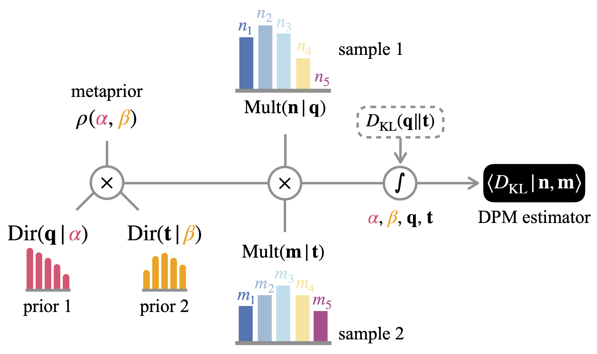

# _catede_

The python software _catede_ is a collection of different estimation methods for the entropy and divergence in the context of categorical distribution with finite number of categories.
Provided a data sample in the shape of a list or other comprehensive supported formats, the software provides methods to estimate the Shannon entropy, the Simpson index, the Kullback-Leibler divergence and the Hellinger distance.
In particular it provides the code for the Dirichlet prior mixture estimators for the divergence, presented in `Missing Paper`.



## Installation

The package _catede_ can be installed by using the setup.py script :

 ```python setup.py install```.

## References

`Missing Paper`

## Tutorial

A brief tutorial can be found [here](tutorial.ipynb).

## Contact

Any issues or questions should be addressed to [us](mailto:francesco.camaglia@phys.ens.fr).

## License

Free use of catede is granted under the terms of the GNU General Public License version 3 (GPLv3).